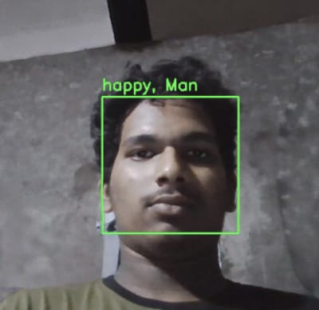

# 🎭 Real-Time Emotion & Gender Detection




A lightweight and fast Python project for **real-time emotion and gender detection** from webcam feed. It leverages the power of **DeepFace** and **OpenCV** to analyze multiple faces simultaneously, displaying the dominant emotion and gender for each person.

---

## 🌟 Features

- **Multi-Face Detection:** Accurately detects and analyzes multiple faces in a single frame.
- **Real-Time Analysis:** Provides instantaneous emotion and gender labels.
- **Dominant Emotion Identification:** Recognizes seven key emotions: happy, sad, neutral, angry, surprise, fear, and disgust.
- **Gender Recognition:** Identifies individuals as either male or female.
- **Intuitive Visualization:** Draws bounding boxes and text labels directly on the video feed for easy interpretation.
- **Minimal Setup:** Simple to install and run with a few straightforward commands.

---

## 🛠️ Technology Stack

- **Python 3.8+**
- **DeepFace (v0.0.95):** A powerful framework for facial analysis.
- **OpenCV (`opencv-python`):** For real-time video stream processing and visualization.

> **Note:** The `opencv` detector backend is used by default for its speed and efficiency. For improved accuracy, you can explore other backends like `mtcnn` or `retinaface` within the `DeepFace` library.

---

## 🚀 Installation

1.  **Clone the repository:**
    ```bash
    git clone [https://github.com/yourusername/RealTime-Emotion-Gender-Detection.git](https://github.com/yourusername/RealTime-Emotion-Gender-Detection.git)
    cd RealTime-Emotion-Gender-Detection
    ```

2.  **Install dependencies:**
    ```bash
    pip install -r requirements.txt
    ```
    (If `requirements.txt` is missing, use `pip install opencv-python deepface numpy`)

---

## 💻 Usage

Run the main script from your terminal:

```bash
python real_time_emotion_gender.py